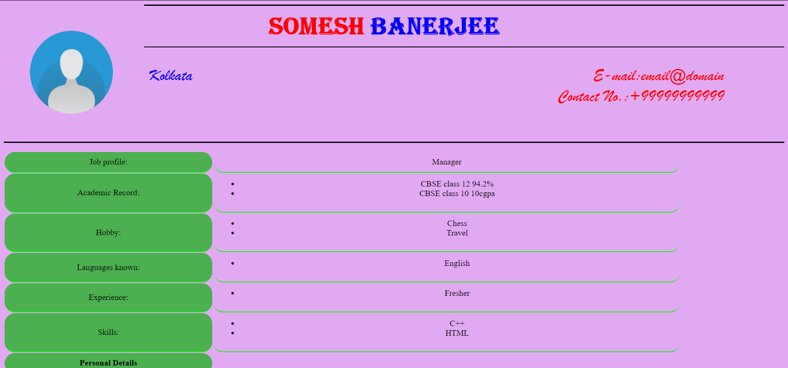

# Resume Maker

C++ code to create a resume using HTML and CSS.
The code is written only to run in Windows.

To execute just double click the `out.exe` file or compile the `resumemaker.cpp` file.

Output Preview:

**Note:**
This was created as my Class 12 Computer Science Project and it has many flaws.
